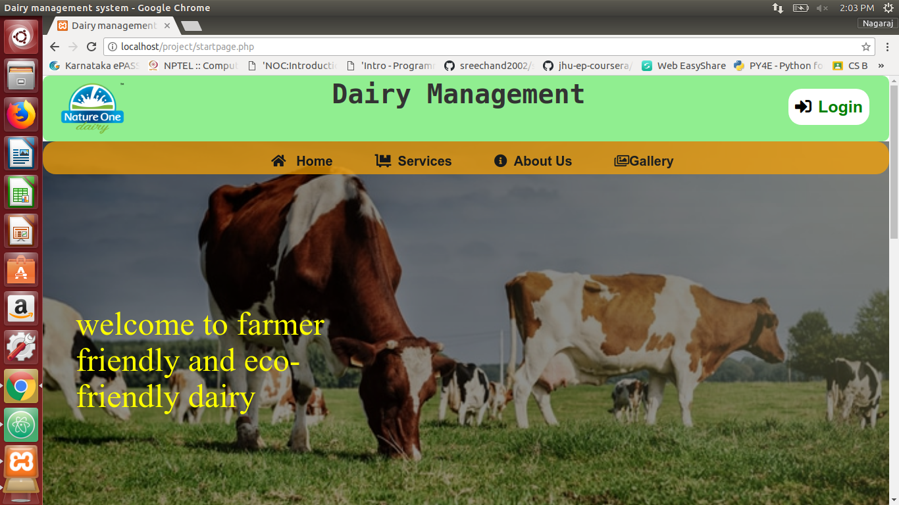
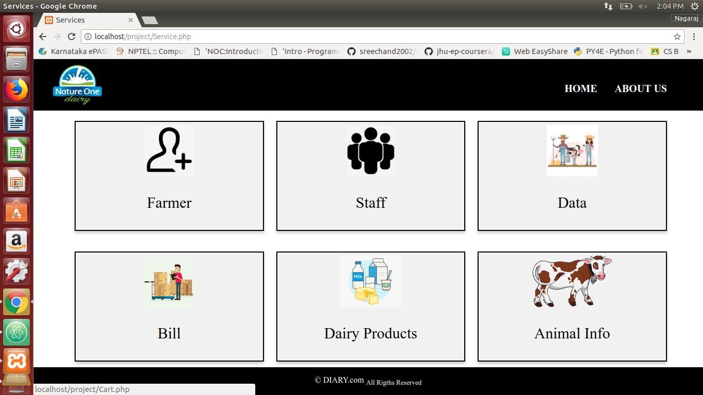

# Dairy-Manangement-System
This is a DBMS Miniproject named Dairy_Management_System.

## Languages Used

**FrontEnd:** Html, CSS, Bootstrap.

**Backend:**  php ,Mysql


## Description
This project contains different Modules like, 
- Login module.
- Farmer Details Module. 
- Staff Details Module. 
- Dairy Animal Details . 
- Daily Data entry Module. 
- Bill Module . 
- Dairy Products Module .

It Contains a Home page which has quick links to Home, Services,Gallery,About Dairy.
----------------------------------------------------------------------------------------------------------------------------------------
```bash
startpage.php is the homepage . 
```

</br>
----------------------------------------------------------------------------------------------------------------------------------------
```bash
The Services has different links to the above mentioned modules which 
can be accessed from the services page.
```

</br>
----------------------------------------------------------------------------------------------------------------------------------------
```bash
Farmer module Page is where the data of the new farmer and old farmer 
can be managed like can be added or deleted.
```

</br>

----------------------------------------------------------------------------------------------------------------------------------------
```bash
Farmer module Page is where the data of the new farmer and old farmer can be 
managed like can be added or deleted.
```

</br>

----------------------------------------------------------------------------------------------------------------------------------------
```bash
staff module Page is where the data of the staff can be managed.
```

</br>

---------------------------------------------------------------------------------------------------------------------------------------
```bash
Animal inforamtion module is where the information regarding the animal i.e. Cow or Buffalo , 
min_litres of milk/day,Animal health ID can be accessed easily.
```

</br>

---------------------------------------------------------------------------------------------------------------------------------------
```bash
Daily Data entry Module is where the registerd farmers sell their milk to the dairy on daily basis.
```

</br>

---------------------------------------------------------------------------------------------------------------------------------------
```bash
Dairy Products module is the products like Milk,Ghee,Butter e.t.c sold to the customers of the dairy.
```

</br>

--------------------------------------------------------------------------------------------------------------------------------------
```bash
Billing module is where the farmers can collect their bill from date to the to date.
```


---------------------------------------------------------------------------------------------------------------------------------------


